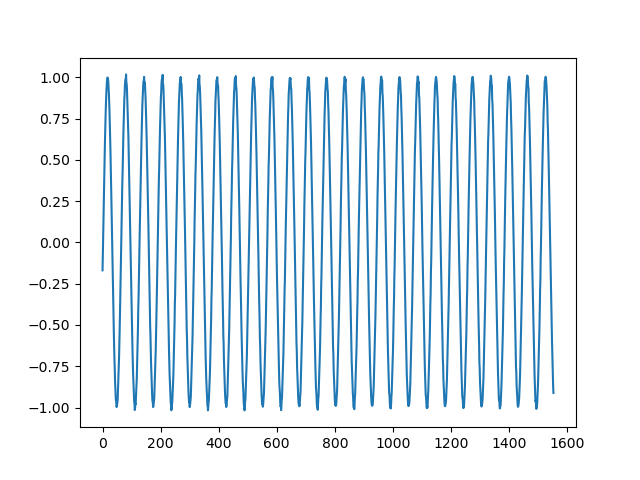

# Generative Adversarial Networks

This example is created using [DCGAN tutorial](https://pytorch.org/tutorials/beginner/dcgan_faces_tutorial.html#introduction) as a reference. This example is purposed towards using GANs for time series analysis, therefore, we will also leverage some of our code from the [LSTMWithCustomerDataset](../../LSTMWithCustomerDataset/README.md) example. 

Another great resource from GitHub on using [GANs for Timeseries with PyTorch](https://github.com/proceduralia/pytorch-GAN-timeseries).

GANs are a framework for teaching a DL model to capture the training data’s distribution so we can generate new data from that same distribution. They are made of two distinct models, a generator and a discriminator. The job of the generator is to create sequences that appear to be from the training dataset. The job of the discriminator is to look at a sequence and determine whether or not it belongs in the training dataset distribution. The goal of the process is for the generator to create sequences that look as if it came directly from the training dataset. 

Training GANs are a bit different than training other neural networks. The training loop for GANs is split into two parts: training the discriminator and training the generator. 

The goal of training the discriminator is to maximize the probability of correctly classifying a given input as real or fake.
1. Construct a batch of real samples from the training set, forward pass through D, calculate the loss, then calculate the gradients in a backward pass
1. Construct a batch of fake samples with the current generator, forward pass this batch through D, calculate the loss, and accumulate the gradients with a backward pass
1. Now, with the gradients accumulated from both the all-real and all-fake batches, we call a step of the Discriminator’s optimizer.

The goal of training the generator is to create the best "fake" data as possible so that we can trick the discriminator into thinking it is real data. In many cases of GANs we will typically pass in random data into the generator network to produce a random output (i.e. image) to fake out the discriminator. In the case with time series it is important that we pass in sequences so that when we go too apply the model in practice we can pass in current time series data and produce a forecast. Essentially instead of using a loss function like `nn.MSELoss()` we use the discriminator as our loss function.    

## Results

