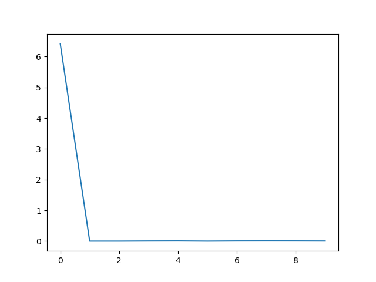
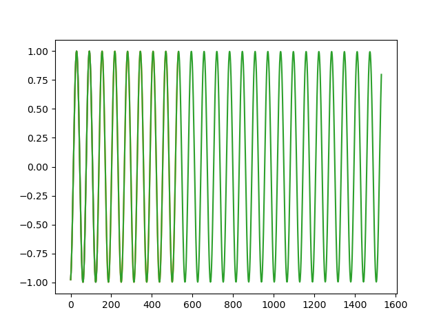

# LSTM with Custom Dataset

In this example, I am going to reproduce the LSTM time series example that is predicting the values in a sine wave. This example was taken from this [PyTorch Example](https://github.com/pytorch/examples/blob/master/time_sequence_prediction/train.py). Often users will create sequences prior to training a network, this code can be cumbersome when it comes to iterating over your experiment and testing our different parameters on how to structure our data. For example, you may want to adjust your sequence length to test how that effects the performance of your network. This can generally be done in your training script before you actually start training, however, this can get a little messy. In this example, we will leverage a custom dataset that will allow us to offload and parameterize data transformations to make our training script cleaner and easier to read. Additionally, parameterizing our dataset transformations will make it easier to adjust our training dataset using different parameter values. 


## Steps
1. In our example we will need to [create our sine wave dataset](create_dataset.py). In our case we will store our data as an hdf5 data file. 
1. Next we will use our dataset in our [training script](train.py), and within our training script we also generate a plot of predictions. 
    - You will notice that the training script will display our training loss using matplotlib and it will also make predictions using the final datapoint in our sine dataset as the starting point. 


**Training Loss**



**Predictions**  
The code below is used to generate predictions. Please notice that we use the output of the model as an input to the next predictions which produces a forecast i.e. we use our predictions to make more predictions.  
```python
for i in range(0, prediction_length):
    with torch.no_grad():
        x_input = x_data[i:i+sequence_length].reshape(1,-1,1).float()
        out = net(x_input)

    x_data = torch.cat((x_data.float(), out.flatten()), dim=0)


plt.plot(range(0, x_data.shape[0]), np.array(x_data.flatten()))
plt.show()
```




Check out the following code snippet to view the custom dataset data directly. 
```python
from PyTorch.LSTMWithCustomDataset.sine_dataset import SineWaveDataset
from torch.utils.data import DataLoader
import h5py

sine_data = SineWaveDataset(data_path="PyTorch/LSTMWithCustomDataset/data/sine_wave_data.hdf5")


sine_data.__getitem__(994)
f = h5py.File("PyTorch/LSTMWithCustomDataset/data/sine_wave_data.hdf5", 'r')
data = f['default']
print(data[5])


dataloader = DataLoader(sine_data, batch_size=4, shuffle=False, num_workers=2)


for X, y in dataloader:
    print("--------- x: {}".format(X))
    print("--------- y: {}".format(y))


len(sine_data)

```
