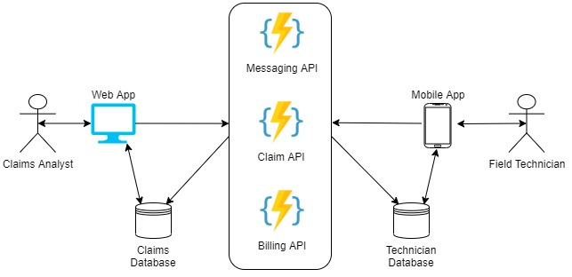
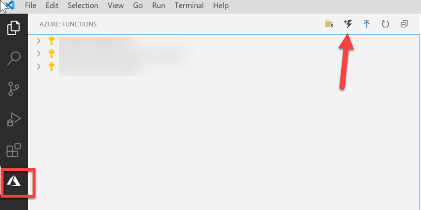

# Messaging API

This project is a demonstration of how to use Azure Functions for event driven architectures for applications. In this scenario lets assume we are building a mobile application that needs to interact with an existing web application. In the diagram below we can assume that we are a high-end appliance manufacturing company that works in the claims department. Claims analysts currently use a web application to manage warranty claims internally and track field technician work. Most of the communication between claims analysts and technicians is done through email making the processing quite cumbersome. In an effort to ease the workload, we are going to create a mobile application for better communication and updates between the two services.  

<div style="text-align:center"></div>
  

This project will build out a messaging API demo that provides easy communication between the web app and mobile app seen in the diagram above.  

## Setup

Requirements:  
- [Visual Studio Code](https://code.visualstudio.com/download)  
- [Anaconda](anaconda.org)  
- [Azure Functions](https://marketplace.visualstudio.com/items?itemName=ms-azuretools.vscode-azurefunctions) Tooling for VS Code
- [Azure Storage Emulator](https://docs.microsoft.com/en-us/azure/storage/common/storage-use-emulator)
- [Azure Storage Explorer](https://azure.microsoft.com/en-us/features/storage-explorer/)

Create an Azure Function project locally. 
1. Navigate to the Azure tools on the left sidebar and click the create project button.  

    


1. You will be prompted to create a new project in your current folder, click **yes**. Then. 
    - Select Python as the language
    - Create a new virtual environment by providing "3.7".
    - Select "HTTP Trigger" template.
    - Provide a name for your project, mine is "MessageAPI". 
    - Select your authentication level, **Anonymous** should be fine for now.  


## Executing the Code  

If by following along with the [tutorial](./docs) your project should mirror the code in this repository. To start the function type the following in the command line to run the function locally. 
```
func host start
```

We can then send HTTP Post Requsts with the following Python code. 
```python
import requests
d = requests.post("http://localhost:7071/api/MessageAPI", json={'to': 'analyst', 'from': 'technician', 'msg': "Hello World!"})
d.status_code
d.content
```
